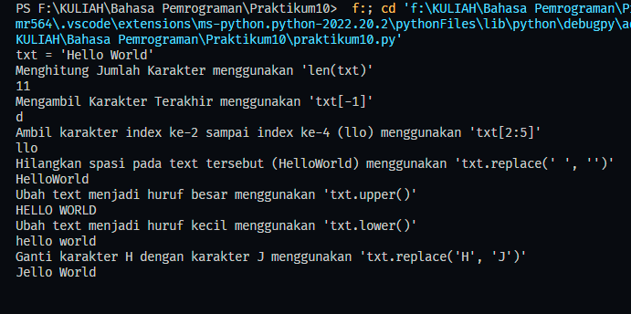
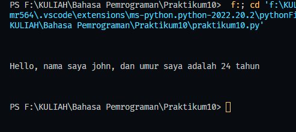

# Tugas Python Pertemuan 14
___
Nama    : Muhammad Rizky<br>
NIM     : 312210576<br>
Kelas   : TI.22.B2<br>
Mapel   : Bahasa Pemrograman<br>

# `Latihan 1`

### Soal Latihan 1</br>

txt = 'Hello World' </br>

- Hitung jumlah karakternya </br>
- Ambil karakter terakhir</br>
- Ambil karakter index ke-2 sampai index ke-4 (llo)</br>
- Hilangkan spasi pada text tersebut (HelloWorld)</br>
- Ubah text menjadi huruf besar</br>
- Ubah text menjadi huruf kecil</br>
- Ganti karakter H dengan karakter J</br>

```python
    txt = 'Hello World'
    print("txt = 'Hello World'")

    print("Menghitung Jumlah Karakter menggunakan 'len(txt)'")
    print(len(txt))

    print("Mengambil Karakter Terakhir menggunakan 'txt[-1]'")
    print(txt[-1])

    print("Ambil karakter index ke-2 sampai index ke-4 (llo) menggunakan 'txt[2:5]'")
    print(txt[2:5])

    print("Hilangkan spasi pada text tersebut (HelloWorld) menggunakan 'txt.replace(' ', '')'")
    print(txt.replace(" ", ""))

    print("Ubah text menjadi huruf besar menggunakan 'txt.upper()'")
    print(txt.upper())

    print("Ubah text menjadi huruf kecil menggunakan 'txt.lower()'")
    print(txt.lower())

    print("Ganti karakter H dengan karakter J menggunakan 'txt.replace('H', 'J')'")
    print(txt.replace("H", "J"))
```

<br>

# `Latihan 2`

### Soal Latihan 2</br>
- Lengkapi Kode Berikut :

```python
    umur = 24
    txt = 'Hello, nama saya john, dan umur saya adalah...tahun'

    print(txt.format(umur))    
```

- Kode yang sudah di lengkapi
```python
    umur = 24
    txt = 'Hello, nama saya john, dan umur saya adalah {} tahun'

    print(txt.format(umur))    
```
<br>

### Terimakasih...